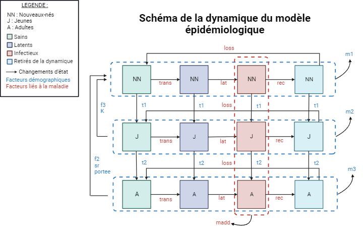

```{r setup, include=FALSE}
knitr::opts_chunk$set(echo = TRUE)
```

# Projet MEPI : Analyse de sensibilité d'un modèle épidémiologique

## Détermination du modèle

Effacer les variables et les graphiques créés lors d'exécutions précédentes

```{r}
rm(list=ls())
graphics.off()
```

Charger les librairies nécessaires

```{r}
library(ggplot2)
library(tidyr)
library(sensitivity)
```

On considère dans ce modèle :

**3 classes d'âge :**

\- *NN* : Nouveaux-nés

\- *J* : Jeunes

\- *A* : Adultes

\- *N* : Population totale

**4 états de santé :**

\- *S* : Sain

\- *IN* : Latent

\- *II* : Infectieux

\- *R* : Remis

Sur une période de 2 ans soit 2 x 365 jours.

En sortie on a une matrice avec en ligne les paramètres et 4 colonnes.

*Boucle des scénarios de l'échantillonnage de l'AS*

15 paramètres au total avec

## 1. Description du modèle

a.  Le modèle est un modèle déterministe (sans facteur aléatoire) à compartiments (états de santé et classe d'âge) à temps discret (par jour).

b.  Les processus biologiques en jeu sont :

-   La mort naturelle
-   La mort liée à la maladie
-   La naissance de nouveaux-nés
-   La croissance (changement de classe d'âge) linéaire unidirectionnelle (sans regression)
-   Transmission de la maladie
-   Période de latence entre état infecté neutre et infecté infectieux (incubation)
-   Période d'immunité

c.  Equations associées :

**Classe d'âge NN (nouveaux nés)**

$$S_{NN_{t+1}} = S_{NN_t} (1 - m_{1} - t_{1} - \frac{trans . I_{N_t}}{N}) + loss . R_{NN_t} + max( 0,\ s_{R} . portee . \sum_{J} . f_{2}) + \sum_{A} . f_{3} (1 - \frac{N}{K}) $$

$$L_{NN_{t+1}} = L_{NN_t}(1 - m_{1} - t{1} - \text{lat}) + \frac{\text{trans} . S_{NN_t} . I_{N_t}}{N}$$

$$I_{NN{t+1}} = I_{NN_t}(1 - m_{1} - madd - t_{1} - rec) + lat . L_{NN_t}$$

$$R_{NN{t+1}} = R_{NN_t}(1 - m_{1} - t_{1} - loss) + rec . I_{NN_t}$$

**Classe d'âge J (jeunes)**

$$S_{J_{t+1}} = S_{NN_t}.t_{1} + S_{J_t}(1 - m_{2} - t_{2} - \frac{trans . I_{N_t}}{N}) + loss.R_{J_t}$$

$$L_{J_{t+1}} = L_{NN_t}.t_{1} + IN_{J_t}(1 - m_{2} - t_{2} - lat) + \frac{trans.S_{J_t}.I_{N_t}}{N}$$

$$I_{J_{t+1}} = I_{NN_t}.t_{1} + I_{J_t}(1 - m_{2} - madd - t_{2} - rec) + lat.L_{J_t}$$

$$R_{J_{t+1}} = R_{NN_t}.t_{1} + R{J_t}(1 - m_{2} - t_{2} - loss) + rec.I_{J_t}$$

**Classe d'âge A (adultes)**

$$S_{A_{t+1}} = S_{J_t}.t_{2} + S_{A_t}(1 - m_{3} - \frac{trans.I_{N_t}}{N}) + loss.R_{A_t}$$

$$L_{A_{t+1}} = L_{J_t}.t_{2} + L_{A_t}(1 - m_{3} - lat) + \frac{trans.S_{A_t}.I_{N_t}}{N}$$

$$I_{A_{t+1}}= I_{J_t}.t_{2} + I{A_t}(1 - m_{3} - madd - rec) + lat.L_{A_t}$$

$$R_{A_{t+1}}=R_{J_t}.t_{2}+R_{A_t}(1-m_{3}-loss)+rec.I_{A_t}$$

**Total** $$S_{N_{t+1}}=S_{NN_{t+1}}+S_{J_{t+1}}+S_{A_{t+1}}$$

$$L_{N_{t+1}}=L_{NN_{t+1}}+L_{J_{t+1}}+L_{A_{t+1}}$$

$$I_{N_{t+1}}=I_{NN_{t+1}}+I_{J_{t+1}}+I_{A_{t+1}}$$

$$R_{N_{t+1}}=R_{NN_{t+1}}+R_{J_{t+1}}+R_{A_{t+1}}$$

**Niveau d'"infectiosité" de l'agent pathogène par jour**

$$Nv_{inf_{t+1}}=trans.S_{N_t}(\frac{I_{N_t}}{N})$$

**Niveau d'"infectiosité" de l'agent pathogène par jour**

$$Nv_{inf_{t+1}}=trans.S_{N_t}(\frac{II_{N_t}}{N})$$

d.  Schéma des transitions entre états

```{r}

```

e.  Les hypothèses principales du modèle sont :

Paramètres démographiques :

-   La population se renouvelle (naissances et morts)
-   La mortalité naturelle est la même par classe d'âge
-   Les jeunes et les adultes se reproduisent dans des proportions différentes
-   Le passage d'une classe d'âge à une autre est identique pour tous les états de santé d'une classe d'âge

Paramètres liés à l'AP :

-   L'AP peut uniquement infecter les individus sains, et de toutes les classes d'âge
-   Une période de latence précède l'état infectieux de l'individu infecté
-   Après la période d'immunité, l'individu redevient sensible à l'AP

f.  Initialement il y a :

-   27 Nouveaux-nés sains
-   23 Jeunes sains
-   36 Adultes sains
-   1 Adulte infectieux

g.  Les sorties possibles du modèle sont :

-   Taux d'infectés (latents et infectieux) le dernier jour
-   Incidence de l'AP au dernier jour
-   Nombre maximum d'infectés infectieux sur la période de temps étudiée
-   Incidence de l'AP pour 1 an

h.  

Paramètres liés à la population étudiée :

-   *K* : **100**, Nombre maximal d'individus que le milieu peut supporter
-   *sr* : **0.5**, Sex-ratio
-   *m1* : **0.0014**, Mortalité naturelle des nouveaux-nés
-   *m2* : **0.00029**, Mortalité naturelle des jeunes
-   *m3* : **0.0019**, Mortalité naturelle des adultes
-   *f2* : **0.0019**, Taux de fécondité des jeunes
-   *f3* : **0.0082**, Taux de fécondité des adultes
-   *portee* : **5**, Effectif maximal d'une portée
-   *t1* : **1/365**, Probabilité de passage de la classe d'âge "nouveau-né" à "jeune"
-   *t2* : **1/365**, Probabilité de passage de la classe d'âge "jeune" à "adulte"

Paramètres liés à la maladie :

-   *trans* : **0.3**, force d'infection
-   *lat* : **1/5**, taux de la latence
-   *rec* : **1/20**, taux de passage à un état d'immmunité
-   *loss* : **1/100**, taux de passage d'un état d'immunité à un état sensible (sain)
-   *madd* : **0.001**, mortalité lié à l'infection par l'AP

i.  Réaliser des graphiques afin d'illustrer le comportement du modèle avec les valeurs nominales

```{r, echo = F}
modAppli <- function(parametre){  

  # CONDITIONS DE SIMULATION
  temps = 2*365; # nb de pas de temps (en jours)
  # initialisation pour la sauvegarde de 4 sorties ponctuelles pour chaque jeu de parametres
  sorties <- matrix(0, nrow=nrow(parametre), ncol=4)
  #initialisation pour la sauvegarde des dynamique de la population
  sortiepop=matrix(0,16,2*365)

  # boucle des scenarios de l'echantillonnage de l'AS
  for (i in 1:nrow(parametre)) { 

    # STRUCTURE & PARAMETRES DU MODELE

    # XX
    K = parametre[i,1];		# xx
    sr = parametre[i,2];	# xx
    m1 = parametre[i,3];	# mort naturelle classe 1
    m2 = parametre[i,4];	# mort naturelle classe 2
    m3 = parametre[i,5];	# mort naturelle classe 3
    f2 = parametre[i,6];	# xx
    f3 = parametre[i,7];	# xx
    portee = parametre[i,8];	# xx
    t1 = parametre[i,9];	# xx
    t2 = parametre[i,10];	# xx

    # XX
    trans = parametre[i,11]; # tx transmission
    lat = parametre[i,12];	# latence
    rec = parametre[i,13];	# xx
    loss = parametre[i,14];	# xx
    madd = parametre[i,15];	# xx

    # INITIALISATION
    MAT <- array(0, dim=c(4,4,temps)); # nb indiv par classe d'age en ligne (derniere ligne = pop tot), etat de sante en colonne, pas de temps (dimension 3)
    nvinf <- array(0, dim=c(temps));
    
    #Plot
    plot(x = NA, y = NA, xlim = c(0, 730), ylim = c(0, 40),
         type = "n", xlab = "Temps (jours)", ylab = "Nombre d'individus")

    # conditions initiales (la population est a sa structure d'equilibre, calculee par ailleurs)
    MAT[1,1,1] <- 27; # xx
    MAT[2,1,1] <- 23; # xx
    MAT[3,1,1] <- 36; # xx
    MAT[3,3,1] <- 1;  # xx
    # effectifs par etat de sante
    MAT[4,1,1] <- sum(MAT[1:3,1,1]); MAT[4,2,1] <- sum(MAT[1:3,2,1]); MAT[4,3,1] <- sum(MAT[1:3,3,1]); MAT[4,4,1] <- sum(MAT[1:3,4,1]);

    #condition initiale
    sortiepop[1,1]=27
    sortiepop[5,1]=23
    sortiepop[9,1]=36
    sortiepop[11,1]=1
    sortiepop[13,1]=sortiepop[1,1]+sortiepop[5,1]+sortiepop[9,1]
    sortiepop[14,1]=sortiepop[2,1]+sortiepop[6,1]+sortiepop[10,1]
    sortiepop[15,1]=sortiepop[3,1]+sortiepop[7,1]+sortiepop[11,1]
    sortiepop[16,1]=sortiepop[4,1]+sortiepop[8,1]+sortiepop[12,1]
    
    # SIMULATIONS
    # boucle du temps
    for (t in 1:(temps-1)) { 
     # classe d'age 1 (nouveau-ne)
      # RQ : les naissances sont XX, les nouveaux nes etant dans l'etat XX
      N <- sum(MAT[4,,t]);	# taille de la pop en t
	MAT[1,1,t+1] <- MAT[1,1,t]*(1-m1-t1-trans*MAT[4,3,t]/N) + loss*MAT[1,4,t]      + max(0, sr*portee*(sum(MAT[2,,t])*f2 + sum(MAT[3,,t])*f3) * (1 - N/K)); 
	MAT[1,2,t+1] <- MAT[1,2,t]*(1-m1-t1-lat)			  + trans*MAT[1,1,t]*MAT[4,3,t]/N; 
	MAT[1,3,t+1] <- MAT[1,3,t]*(1-m1-madd-t1-rec)  		  + lat*MAT[1,2,t]; 
	MAT[1,4,t+1] <- MAT[1,4,t]*(1-m1-t1-loss) 		  + rec*MAT[1,3,t]; 
     # classe d'age 2 (jeune)
	MAT[2,1,t+1] <- MAT[1,1,t]*t1	+ MAT[2,1,t]*(1-m2-t2-trans*MAT[4,3,t]/N) + loss*MAT[2,4,t];
	MAT[2,2,t+1] <- MAT[1,2,t]*t1	+ MAT[2,2,t]*(1-m2-t2-lat)			+ trans*MAT[2,1,t]*MAT[4,3,t]/N;
	MAT[2,3,t+1] <- MAT[1,3,t]*t1	+ MAT[2,3,t]*(1-m2-madd-t2-rec)		+ lat*MAT[2,2,t];
	MAT[2,4,t+1] <- MAT[1,4,t]*t1	+ MAT[2,4,t]*(1-m2-t2-loss)			+ rec*MAT[2,3,t];
     # classe d'age 3 (adulte)
	MAT[3,1,t+1] <- MAT[2,1,t]*t2	+ MAT[3,1,t]*(1-m3-trans*MAT[4,3,t]/N) 	+ loss*MAT[3,4,t];
	MAT[3,2,t+1] <- MAT[2,2,t]*t2	+ MAT[3,2,t]*(1-m3-lat)				+ trans*MAT[3,1,t]*MAT[4,3,t]/N;
	MAT[3,3,t+1] <- MAT[2,3,t]*t2	+ MAT[3,3,t]*(1-m3-madd-rec)			+ lat*MAT[3,2,t];
	MAT[3,4,t+1] <- MAT[2,4,t]*t2	+ MAT[3,4,t]*(1-m3-loss)			+ rec*MAT[3,3,t];
     # calcul des effectifs par etat de sante
	MAT[4,1,t+1] <- sum(MAT[1:3,1,t+1]); 
	MAT[4,2,t+1] <- sum(MAT[1:3,2,t+1]); 
	MAT[4,3,t+1] <- sum(MAT[1:3,3,t+1]); 
	MAT[4,4,t+1] <- sum(MAT[1:3,4,t+1]);
	nvinf[t+1]   <- trans*MAT[4,1,t]*MAT[4,3,t]/N

	#NN
	sortiepop[1,t+1]=MAT[1,1,t+1]
	sortiepop[2,t+1]=MAT[1,2,t+1]
	sortiepop[3,t+1]=MAT[1,3,t+1]
	sortiepop[4,t+1]=MAT[1,4,t+1]
  #J
	sortiepop[5,t+1]=MAT[2,1,t+1]
	sortiepop[6,t+1]=MAT[2,2,t+1]
	sortiepop[7,t+1]=MAT[2,3,t+1]
	sortiepop[8,t+1]=MAT[2,4,t+1]
  #A
	sortiepop[9,t+1]=MAT[3,1,t+1]
	sortiepop[10,t+1]=MAT[3,2,t+1]
	sortiepop[11,t+1]=MAT[3,3,t+1]
	sortiepop[12,t+1]=MAT[3,4,t+1]
  #pop totale
	sortiepop[13,t+1]=MAT[4,1,t+1]#sain
	sortiepop[14,t+1]=MAT[4,2,t+1]#IN
	sortiepop[15,t+1]=MAT[4,3,t+1]#II
	sortiepop[16,t+1]=MAT[4,4,t+1]#R
	
    }# fin boucle temps

    # sorties ponctuelles a analyser
    # taux des infectes au dernier jours
    sortie1 <- (MAT[4,2,temps]+MAT[4,3,temps])/sum(MAT[4,,temps])
    # incidence du dernier jour
    sortie2 <- nvinf[temps]
    # nbr max d'infectes infectieux sur les 2 ans
    sortie3 <- max(MAT[4,3,1:temps])
    # incidence sur l'année
    sortie4 <- sum(nvinf[1:365])
    
    sorties[i,1] <- sortie1;
    sorties[i,2] <- sortie2;
    sorties[i,3] <- sortie3;
    sorties[i,4] <- sortie4;
    
  }# fin boucle scenarios AS
  lines(sortiepop[1,],col="green")
  lines(sortiepop[2,],col="purple")
  lines(sortiepop[3,],col="red")
  lines(sortiepop[4,],col="blue")
  lines(sortiepop[5,],lty = 2,col="green")
  lines(sortiepop[6,],lty = 2,col="purple")
  lines(sortiepop[7,],lty = 2,col="red")
  lines(sortiepop[8,],lty = 2,col="blue")
  lines(sortiepop[9,],lty = 3,col="green")
  lines(sortiepop[10,],lty = 3,col="purple")
  lines(sortiepop[11,],lty = 3,col="red")
  lines(sortiepop[12,],lty = 3,col="blue")
  #lines(sortiepop[13,],col="green")
  #lines(sortiepop[14,],col="purple")
  #lines(sortiepop[15,],col="red")
  #lines(sortiepop[16,],col="blue")
  
  return(sorties)
} # fin fonction du modele

# END
ValNominale = c(100, 0.5, 0.0014, 0.00029, 0.0019, 0.0019, 0.0082, 5, 1/365, 
                1/365, 0.3, 1/5, 1/20, 1/100, 0.001)

Par=matrix(ValNominale,nrow=1,ncol=15)
sol = modAppli(Par)
```

## 2. Analyse de sensibilité : méthode OAT

a.  Justifier les valeurs testées

On fait varier les valeurs à +/- 25% des valeurs nominales. Cela permet de réaliser une analyse de sensibilité en gardant des valeurs viables.

b.  Script de l'analyse OAT

Fonction du modèle à analyser

```{r}
modAppli <- function(parametre){  

  # CONDITIONS DE SIMULATION
  temps = 2*365; # nb de pas de temps (en jours)
  # initialisation pour la sauvegarde de 4 sorties ponctuelles pour chaque jeu de parametres
  sorties <- matrix(0, nrow=nrow(parametre), ncol=4)

  # boucle des scenarios de l'?chantillonnage de l'AS
  for (i in 1:nrow(parametre)) { 

    # STRUCTURE & PARAMETRES DU MODELE

    # Parametres demographiques
    K = parametre[i,1];		    # Nombre maximal d'individus que le milieu peut supporter
    sr = parametre[i,2];	    # Sex-ratio
    m1 = parametre[i,3];	    # Mortalité naturelle des nouveaux-nés
    m2 = parametre[i,4];	    # Mortalité naturelle des jeunes
    m3 = parametre[i,5];	    # Mortalité naturelle des adultes
    f2 = parametre[i,6];	    # Taux de fécondité des jeunes
    f3 = parametre[i,7];	    # Taux de fécondité des adultes
    portee = parametre[i,8];	# Effectif maximal d'une portée
    t1 = parametre[i,9];	    # Probabilité de passage de la classe d'âge "nouveau-né" à "jeune"
    t2 = parametre[i,10];	    # Probabilité de passage de la classe d'âge "jeune" à "adulte"

    # Parametres lies a l'agent pathogène
    trans = parametre[i,11];  # Force d'infection
    lat = parametre[i,12];	  # Taux de la latence
    rec = parametre[i,13];	  # Taux de passage à un état d'immmunité
    loss = parametre[i,14];	  # Taux de passage d'un état d'immunité à un état sensible (sain)
    madd = parametre[i,15];	  # Mortalité lié à l'infection par l'AP

    # INITIALISATION
    MAT <- array(0, dim=c(4,4,temps)); # nb indiv par classe d'age en ligne (derniere ligne = pop tot), etat de sante en colonne, pas de temps (dimension 3)
    nvinf <- array(0, dim=c(temps));
    # conditions initiales (la population est a sa structure d'equilibre, calculee par ailleurs)
    MAT[1,1,1] <- 27; # Effectif des individus nouveaux-nes sains le premier jour
    MAT[2,1,1] <- 23; # Effectif des individus jeunes sains le premier jour
    MAT[3,1,1] <- 36; # Effectif des individus adultes sains le premier jour 
    MAT[3,3,1] <- 1;  # Effectif des individus adultes infectes infectieux le premier jour

    # Effectifs par etat de sante
    MAT[4,1,1] <- sum(MAT[1:3,1,1]); MAT[4,2,1] <- sum(MAT[1:3,2,1]); MAT[4,3,1] <- sum(MAT[1:3,3,1]); MAT[4,4,1] <- sum(MAT[1:3,4,1]);

    # SIMULATIONS
    # Boucle du temps
    for (t in 1:(temps-1)) { 
     # Classe d'age Nouveau-né
      # RQ : les naissances sont XX, les nouveaux nes etant dans l'etat NN
      N <- sum(MAT[4,,t]);	# Taille de la pop en t
      MAT[1,1,t+1] <- MAT[1,1,t]*(1-m1-t1-trans*MAT[4,3,t]/N) + loss*MAT[1,4,t]      + max(0, sr*portee*(sum(MAT[2,,t])*f2 + sum(MAT[3,,t])*f3) * (1 - N/K)); 
      MAT[1,2,t+1] <- MAT[1,2,t]*(1-m1-t1-lat)			  + trans*MAT[1,1,t]*MAT[4,3,t]/N; 
      MAT[1,3,t+1] <- MAT[1,3,t]*(1-m1-madd-t1-rec)  		  + lat*MAT[1,2,t]; 
      MAT[1,4,t+1] <- MAT[1,4,t]*(1-m1-t1-loss) 		  + rec*MAT[1,3,t]; 
     # classe d'age Jeune
      MAT[2,1,t+1] <- MAT[1,1,t]*t1	+ MAT[2,1,t]*(1-m2-t2-trans*MAT[4,3,t]/N) + loss*MAT[2,4,t];
      MAT[2,2,t+1] <- MAT[1,2,t]*t1	+ MAT[2,2,t]*(1-m2-t2-lat)			+ trans*MAT[2,1,t]*MAT[4,3,t]/N;
      MAT[2,3,t+1] <- MAT[1,3,t]*t1	+ MAT[2,3,t]*(1-m2-madd-t2-rec)		+ lat*MAT[2,2,t];
      MAT[2,4,t+1] <- MAT[1,4,t]*t1	+ MAT[2,4,t]*(1-m2-t2-loss)			+ rec*MAT[2,3,t];
     # classe d'age Adulte
      MAT[3,1,t+1] <- MAT[2,1,t]*t2	+ MAT[3,1,t]*(1-m3-trans*MAT[4,3,t]/N) 	+ loss*MAT[3,4,t];
      MAT[3,2,t+1] <- MAT[2,2,t]*t2	+ MAT[3,2,t]*(1-m3-lat)				+ trans*MAT[3,1,t]*MAT[4,3,t]/N;
      MAT[3,3,t+1] <- MAT[2,3,t]*t2	+ MAT[3,3,t]*(1-m3-madd-rec)			+ lat*MAT[3,2,t];
      MAT[3,4,t+1] <- MAT[2,4,t]*t2	+ MAT[3,4,t]*(1-m3-loss)			+ rec*MAT[3,3,t];
     # calcul des effectifs par etat de sante
      MAT[4,1,t+1] <- sum(MAT[1:3,1,t+1]); MAT[4,2,t+1] <- sum(MAT[1:3,2,t+1]); MAT[4,3,t+1] <- sum(MAT[1:3,3,t+1]); MAT[4,4,t+1] <- sum(MAT[1:3,4,t+1]);
      nvinf[t+1]   <- trans*MAT[4,1,t]*MAT[4,3,t]/N

    }# fin boucle temps

    # Sorties ponctuelles a analyser
    
    # Taux d'infectés le dernier jours
    sortie1 <- (MAT[4,2,temps] + MAT[4,3,temps]) / sum(MAT[4,,temps])
    # Incidence le dernier jour
    sortie2 <- nvinf[temps]
    # Nombre maximum d'infectieux en 2 ans
    sortie3 <- max(MAT[4,3,1:temps])
    # Incidence sur l'année
    sortie4 <- sum(nvinf[1:365])
    
    sorties[i,1] <- sortie1;
    sorties[i,2] <- sortie2;
    sorties[i,3] <- sortie3;
    sorties[i,4] <- sortie4;
    
  }# fin boucle scenarios AS
  return(sorties)
}
```

Stocker les valeurs des paramètres dans une matrice

```{r}
ValNominale = c(100, 0.5, 0.0014, 0.00029, 0.0019, 0.0019, 0.0082, 5, 1/365, 1/365, 0.3, 1/5, 1/20, 1/100, 0.001)
ParamNames = c("K", "sr", "m1", "m2", "m3", "f2", "f3", "portee", "t1", "t2", "trans", "lat", "rec", "loss", "madd")

# Gammes de variation des paramètres
ParamRanges = data.frame(
  lower = ValNominale * 0.75,
  upper = ValNominale * 1.25
)

# Matrice des paramètres de base
param_matrix_first <- matrix(ValNominale,
                             nrow = 1, 
                             ncol = length(ValNominale))

# Matrice des paramètres variants
param_matrix_var <- matrix(0, 
                           nrow = 10, 
                           ncol = length(ValNominale))
for (i in 1:length(ValNominale)) {
  param_matrix_var[, i] <- seq(ParamRanges$lower[i], ParamRanges$upper[i], length.out = 10)
}

# Créer un dataframe qui stock les résultats de la sortie 1 de l'analyse de sensibilité
SensitivityResults <- data.frame(Parameter = character(0), Sensitivity = numeric(0))
```

Réaliser l'analyse OAT

```{r}
for (i in 1:length(ValNominale)) {
  for (j in 1:10) {
    # Faire varier notre paramètre
    param_matrix <- param_matrix_first
    param_matrix[1,i] <- param_matrix_var[j,i]
    
    # Exécuter le modèle pour chaque combinaison de paramètres
    output <- modAppli(param_matrix)
    
    # Créez un data.frame temporaire pour stocker les résultats de cette itération
    temp_df <- data.frame(Parameter = ParamNames[i],
                          Val = param_matrix[, i],
                          Sensitivity1 = output[,1],
                          Sensitivity2 = output[,2],
                          Sensitivity3 = output[,3],
                          Sensitivity4 = output[,4])
    
    # Ajoutez les résultats à SensitivityResults
    SensitivityResults <- rbind(SensitivityResults, temp_df)
  }
}
```

c.  Réalisez des figures illustrant le comportement du modèle

```{r}
# Plot des résultats taux d'infecté au dernier jour et incidence de la maladie le dernier jour
ggplot(SensitivityResults, aes(x = Val, y = Sensitivity1)) +
  geom_line(aes(color = "Sensitivity1")) +
  geom_line(data = SensitivityResults, aes(x = Val, y = Sensitivity2, color = "Sensitivity2")) +
  labs(x = "Valeurs des paramètres", y = "Valeurs des indices calculés",colour = NULL) +
  facet_wrap(~Parameter, scales = "free") +
  theme_minimal() +
  scale_color_manual(values = c("Sensitivity1" = "red", "Sensitivity2" = "blue"),
                     labels = c("Taux d'infecté dernier jour", "Incidence dernier jour")) +
  coord_cartesian(ylim = c(0, 1.25))

# Plot des résultats Nombre d'infectés infectieux et l'incidence à l'année
ggplot(SensitivityResults, aes(x = Val, y = Sensitivity3)) +
  geom_line(aes(color = "Sensitivity3")) +
  geom_line(data = SensitivityResults, aes(x = Val, y = Sensitivity4, color = "Sensitivity4")) +
  labs(x = "Valeurs des paramètres", y = "Valeurs des indices calculés", colour = NULL) +
  facet_wrap(~Parameter, scales = "free") +
  theme_minimal() +
  scale_color_manual(values = c("Sensitivity3" = "green", "Sensitivity4" = "purple"),
                     labels = c("Nombre d'infecté infectieux", "Somme de l'incidence à l'année")) +
  coord_cartesian(ylim = c(0, 400))

```

d.  Interpréter les résultats et expliciter des limites possibles

La variation des paramètres **K**, **loss**, **portee**, **rec**, **sr** et **trans** ont un impact sur les sorties du modèle, ils ont donc une sensibilité. En augmentant la valeur de ces paramètres on augmente également le nombre d'infecté le dernier jour, l'incidence le dernier jour, le nombre d'infectieux ainsi que l'incidence d'une année.\
- La valeur de **K** a donc un impact sur la dynamique de la maladie, plus le milieu peut supporter un grand nombre d'individu, plus l'incidence du dernier jour et l'incidence à l'année sera grand.\
- Le paramètre **loss** soit le taux de perte de l'immunité d'un individu impact également la dynamique de la maladie. Quand ce taux augmente, les incidences augmentent également.\
- Le paramètre **portée** impact légèrement le modèle. En augmentant le nombre maximal d'une portée on augmente légèrement les incidences de l'agent pathogène.\
- Le paramètre **rec** (taux d'immunisation) diminu légèrement le taux d'infecté le dernier jour ainsi que le nombre d'infectieux total.\
- **sr** exprime le sex-ratio.\
- Le paramètre **trans** qui transcrit le taux de transmission augmente le nombre d'infectés et les incidences quand il augmente.\
Globalement, les paramètres avec les plus grandes sensibilités sont **K** et **loss**.

-   L'analyse OAT suppose que les paramètres sont indépendants, elle ne tient pas compte d'une potentielle interaction.
-   Les valeurs testées sont déterminées suite à des hypothèses donc subjectives.
-   Ces valeurs ne contienent pas toutes les valeurs biologiques possibles ce qui peut consuire à une sous-estimation de l'impact des paramètres

## 3. Analyse de sensibilité : Méthode Morris

```{r, echo = F}
# Définir les paramètres de l'analyse Morris
n <- 100  # Nombre de trajectoires
p <- length(ValNominale)  # Nombre de paramètres
lower <- ValNominale*0.75
upper <- ValNominale*1.25

# Réaliser l'analyse de sensibilité Morris
morris_results <- morris(model = modAppli,
                         factors = p,
                         r = n,  
                         design = list(type = "oat", levels = 6, grid.jump = 3),
                         binf = lower,
                         bsup = upper,
                         scale=T)


# Visualiser les résultats
par(mfrow = c(2, 2))
plot(morris_results, y_col = 1, main = "Taux d'infectés le dernier jours", atpen = T)
abline(v = 0.1)
abline(h = 0.1)
plot(morris_results, y_col = 2, main = "Incidence le dernier jour")
abline(v = 0.1)
abline(h = 0.1)
plot(morris_results, y_col = 3, main = "Nombre maximum d'infectieux en 2 ans")
abline(v = 0.1)
abline(h = 0.1)
plot(morris_results, y_col = 4, main = "Incidence sur l'année")
abline(v = 0.1)
abline(h = 0.1)
```

## 4. Analyse de sensibilité : Méthode FAST

Lien pour la méthode sur R : <https://rdrr.io/cran/fast/man/sensitivity.html>
### a. Le package utilisé pour l'analyse de sensibilité avec la méthode FAST est 'sensitivity'. 

```{r}
library(sensitivity)
```

Ce package permet d'utiliser des méthodes d'analyse de sensibilité globales et non de screening comme précédemment avec les méthodes OAT et Morris. C'est-à-dire que l'on peut prendre en compte le caractère continu des variables d'entrée et les intéractions entre elles. On peut donc étudier les effets **principaux** (paramètre seul) et **totaux** (intéractions possibles avec d'autres paramètres + paramètre seul) des variables d'entrée. Ce sont des méthodes basées sur la décomposition de la variance. Dans cette catégorie, nous pouvons retrouver la méthode **FAST**, ou 'Fourier Amplitude Sensitivity Test', mais encore la méthode du plan factoriel ou Sobol. 

Le principe est de choisir pour cette étude : 
  - Les variables d'entrée que l'on souhaite suivre. *Dans notre cas, nous choisissons tous les paramètres d'entrée.*
  - Leur plage de variation, avec une valeur minimale et une valeur maximale qui bornent cette plage. *Nous choisissons une variation de +/- 25% de la valeur de base du paramètre afin de rester dans des valeurs réalistes pour le modèle.*
  - Une loi de distribution qui régit la plage de variation. *Nous avons choisi une loi uniforme ('qunif') afin d'avoir une variation homogène de nos paramètres et de n'avoir aucun a priori sur ces derniers.*

Un certain nombre de simulations est effectué pour chaque paramètre dans le but de faire une décomposition de la variance. Le nombre de simulation est important à déterminer car top peu de simulations ne permettent pas de rendre compte finement des variations de la variance pour les paramètres, et trop de simulations peuvent être très coûteuses en temps de calcul. *Dans notre cas, nous allons simuler pour 100 et 1000 scénarios*. 

En sortie de l'analyse, des **indices de sensibilité** sont donnés pour chaque variable d'entrée étudiée et des graphiques nous permettent de nous représenter les effets des différents paramètres.

##### Design expérimental

### b. **Pour 100 simulations**

On définit le design expérimental en premier lieu, puis on l'appelle avec notre fonction afin de faire l'analyse de sensibilité. Pour ce faire, on utilise la fonction 'fast99'. 
```{r}
ParamRanges<-apply( X = cbind(inf = ValNominale*0.75, sup = ValNominale*1.25), 1, function(x){list(min=x[1], max = x[2])}) # plage de variation des paramètres en tant que liste de listes

des_xp100<-fast99(model = NULL, factors = ParamNames, n = 100, q = rep("qunif",15), q.arg = ParamRanges) # Pour creer le design expérimental
des_xp1<-des_xp100$X # On conserve le tableau avec les variations par paramètres
length(des_xp1[,1]) # Longueur du tableau

```

On obtient donc un tableau à 1500 lignes, pour la simulation du paramètre seul, et des intéractions avec les 14 autres pour 100 scénarios. 

### c. Variation des paramètres

Maintenant qu'on a le design exprimental, on peut regarder comment les variations des paramètres remplissent l'espace.
Ici, on représente les variations des paramètres 2 à 2 ici on ne représente que les paramètres K et sr. 

```{r, echo = F}
plot(des_xp1[1:200,1:2], type='p', main = "Variation des paramètres K et sr dans l'espace des paramètres")
plot(des_xp1[1:200,1:2], type='b', main = "Variation des paramètres K et sr dans l'espace des paramètres")
```
L'espace des paramètres est rempli de la même manière quelque soient les paramètres deux à deux. 

*A priori*, on peut voir que l'espace est assez bien rempli.

### d. Pour 1000 trajectoires

On effectue les mêmes démarches pour 1000 scénarios. 

```{r}
des_xp1000<-fast99(model = NULL, factors = ParamNames, n = 1000, q = rep("qunif",15), q.arg = ParamRanges) # Pour creer le design expérimental
des_xp2<-des_xp1000$X # On conserve le tableau avec les variations par paramètres
length(des_xp2[,1]) # Longueur du tableau

```

On obtient donc un tableau de 15000 lignes.

Et pour le design expérimental :

```{r, echo = F}
plot(des_xp2[1:2000,1:2], type='p', main = "Variation des paramètres K et sr dans l'espace des paramètres") 
plot(des_xp2[1:2000,1:2], type='b', main = "Variation des paramètres K et sr dans l'espace des paramètres") 
```
On obtient donc un recouvrement plus important de l'espace que pour seulement 100 simulations.

### e. Comparaison des deux designs expérimentaux

*A priori*, on a l'impression que pour 100 scénarios, on a un recouvrement plus homogène de l'espace
qui suggèrerait potentiellement une analyse FAST plus précise et plus fiable. En revanche, si l'on compare les deux recouvrements, on se rend compte que pour 100 simulations, il y a plus de trous à certains endroits, ce qui rend donc ce paramétrage moins efficace que pour 1000 scénarios.

```{r, echo = F}
plot(des_xp2[1:2000,1:2], type='p', main = "Variation des paramètres K et sr dans l'espace des paramètres", col = "orange") 
points(des_xp1[1:2000,1:2], type='p', main = "Variation des paramètres K et sr dans l'espace des paramètres", col = "purple") 

```

### f. Lancement de l'analyse avec le modèle

Après avoir créé les deux designs expérimentaux, on peut donc passer à l'analyse FAST. 

```{r}
FAST1<-fast99(model = modAppli, factors = ParamNames, n = 100, q = rep("qunif",15), q.arg = ParamRanges)
```

```{r}
FAST2<-fast99(model = modAppli, factors = ParamNames, n = 1000, q = rep("qunif",15), q.arg = ParamRanges)
```


### g. Distribution des sorties obtenues

#### Pour 100 simulations
```{r, echo = F}
par(mfrow=c(2,2))
hist(FAST1$y[1:1500], main = "Analyse de sensibilité FAST : sortie 1", xlab = "Valeurs de la sortie 1")
hist(FAST1$y[1501:3000], main = "Analyse de sensibilité FAST : sortie 2", xlab = "Valeurs de la sortie 2")
hist(FAST1$y[3001:4500], main = "Analyse de sensibilité FAST : sortie 3", xlab = "Valeurs de la sortie 3")
hist(FAST1$y[4501:6000], main = "Analyse de sensibilité FAST : sortie 4", xlab = "Valeurs de la sortie 4")
```

#### Pour 1000 simulations

```{r, echo = F}
par(mfrow=c(2,2))
hist(FAST2$y[1:1500], main = "Analyse de sensibilité FAST : sortie 1", xlab = "Valeurs de la sortie 1")
hist(FAST2$y[1501:3000], main = "Analyse de sensibilité FAST : sortie 2", xlab = "Valeurs de la sortie 2")
hist(FAST2$y[3001:4500], main = "Analyse de sensibilité FAST : sortie 3", xlab = "Valeurs de la sortie 3")
hist(FAST2$y[4501:6000], main = "Analyse de sensibilité FAST : sortie 4", xlab = "Valeurs de la sortie 4")
```

On peut à présent observer les résultats de l'analyse. 

```{r, echo = FALSE}
fast2<-fast99(model = modAppli, factors = ParamNames, n = 100, q = rep("qunif",15), q.arg = ParamRanges)
plot(fast2)


fast2_df <- as.data.frame(fast2$X)
# hist(fast2_df$f3)

# Créer une liste pour stocker les graphiques
plot_list <- list()

# Boucle pour créer les graphiques pour chaque paramètre
for (param in ParamNames) {
  plot <- ggplot(fast2_df, aes(x = param, y = "X2", fill = "Interaction")) +
    geom_bar(stat = "identity", position = "dodge", color = "black") +
    labs(title = paste("Effets principaux et interactions de", param),
         x = param,
         y = "Estimation") +
    theme_minimal() +
    theme(axis.text.x = element_text(angle = 45, hjust = 1))
  
  plot_list[[param]] <- plot
}

for (param in ParamNames) {
  plot <- ggplot(fast2_df, aes(x = param, y = "X2", fill = "Interaction")) +
    geom_bar(stat = "identity", position = "dodge", color = "black") +
    geom_hline(yintercept = 0, linetype = "dashed", color = "red", size = 1) +  # Ajout d'une ligne pour les effets principaux
    labs(title = paste("Effets principaux et interactions de", param),
         x = param,
         y = "Estimation") +
    theme_minimal() +
    theme(axis.text.x = element_text(angle = 45, hjust = 1))
  
  plot_list[[param]] <- plot
}


# Afficher les graphiques
library(gridExtra)
length(plot_list)
plot_list$K
grid.arrange(grobs = plot_list)  # Ajuste ncol en fonction de la mise en page souhaitée


FAST100<-modAppli(des_xp) # Simulation
hist(FAST100)
```

Le graphique ci-contre présente le degré d'importance des paramètres, en effets principaux et effets d'intéraction, sur les sorties du modèle. 

Nous pouvons déjà présenter les effets K, sr, f3 et 

6.  Modifications du modèle

Nous faisons l'hypothèse que la transmission du pathogène est plus grande au sein d'une même classe qu'entre les classes d'âge.

Voici les équations modifiées :

**Classe d'âge NN (nouveaux nés)**

$$S_{NN_{t+1}} = S_{NN_t} (1 - m_{1} - t_{1} - \frac{\color{red}{transIntra} . II_{NN_t}}{N} - \frac{\color{red}{transInter} . (II_{J_t} + II_{A_t})}{N}) + loss . R_{NN_t} + max( 0,\ s_{R} . portee . \sum_{J} . f_{2}) + \sum_{A} . f_{3} (1 - \frac{N}{K}) $$

$$IN_{NN_{t+1}} = IN_{NN_t}(1 - m_{1} - t{1} - \text{lat}) + \frac{\color{red}{transIntra} . S_{NN_t} . II_{NN_t}}{N} + \frac{\color{red}{transInter} . S_{NN_t} . (II_{J_t} + II_{A_t})}{N}$$

$$II_{NN{t+1}} = II_{NN_t}(1 - m_{1} - madd - t_{1} - rec) + lat . IN_{NN_t}$$

$$R_{NN{t+1}} = R_{NN_t}(1 - m_{1} - t_{1} - loss) + rec . II_{NN_t}$$

**Classe d'âge J (jeunes)**

$$S_{J_{t+1}} = S_{NN_t}.t_{1} + S_{J_t}(1 - m_{2} - t_{2} - \frac{\color{red}{transIntra} . II_{J_t}}{N} - \frac{\color{red}{transInter} . (II_{NN_t} + II_{A_t})}{N}) + loss.R_{J_t}$$

$$IN_{J_{t+1}} = IN_{NN_t}.t_{1} + IN_{J_t}(1 - m_{2} - t_{2} - lat) + \frac{\color{red}{transIntra} . S_{J_t} . II_{J_t}}{N} + \frac{\color{red}{transInter} . S_{J_t} . (II_{NN_t} + II_{A_t})}{N}$$

$$II_{J_{t+1}} = II_{NN_t}.t_{1} + II_{J_t}(1 - m_{2} - madd - t_{2} - rec) + lat.IN_{J_t}$$

$$R_{J_{t+1}} = R_{NN_t}.t_{1} + R{J_t}(1 - m_{2} - t_{2} - loss) + rec.II_{J_t}$$

**Classe d'âge A (adultes)**

$$S_{A_{t+1}} = S_{J_t}.t_{2} + S_{A_t}(1 - m_{3} - \frac{\color{red}{transIntra} . II_{A_t}}{N} - \frac{\color{red}{transInter} . (II_{NN_t} + II_{J_t})}{N}) + loss.R_{A_t}$$

$$IN_{A_{t+1}} = IN_{J_t}.t_{2} + IN_{A_t}(1 - m_{3} - lat) + \frac{\color{red}{transIntra} . S_{A_t} . II_{A_t}}{N} + \frac{\color{red}{trandInter} . S_{A_t} . (II_{NN_t} + II_{J_t})}{N}$$

$$II_{A_{t+1}}= II_{J_t}.t_{2} + II{A_t}(1 - m_{3} - madd - rec) + lat.IN_{A_t}$$

$$R_{A_{t+1}}=R_{J_t}.t_{2}+R_{A_t}(1-m_{3}-loss)+rec.II_{A_t}$$

**Total** $$S_{N_{t+1}}=S_{NN_{t+1}}+S_{J_{t+1}}+S_{A_{t+1}}$$

$$IN_{N_{t+1}}=IN_{NN_{t+1}}+IN_{J_{t+1}}+IN_{A_{t+1}}$$

$$II_{N_{t+1}}=II_{NN_{t+1}}+II_{J_{t+1}}+II_{A_{t+1}}$$

$$R_{N_{t+1}}=R_{NN_{t+1}}+R_{J_{t+1}}+R_{A_{t+1}}$$

**Niveau d'"infectiosité" de l'agent pathogène par jour**

$$Nv_{inf_{t+1}}=\color{red}{transIntra}.S_{N_t}(\frac{II_{N_t}}{N}) + \color{red}{transInter}.S_{N_t}(\frac{II_{N_t}}{N})$$

## b. Réaliser les mêmes analyses

Nouveau modèle

```{r}
modApplimodif <- function(parametre){  
  
  # CONDITIONS DE SIMULATION
  temps = 2*365; # nb de pas de temps (ou simulations), en jours
  # initialisation pour la sauvegarde de 4 sorties ponctuelles pour chaque jeu de parametres
  sorties <- matrix(0, nrow=nrow(parametre), ncol=4)
  
  
  
  # boucle des scenarios de l'echantillonnage de l'AS
  for (i in 1:nrow(parametre)) { 
    
    
    # STRUCTURE & PARAMETRES DU MODELE
    
    # Parametres demographiques
    K = parametre[i,1];		# nombre maximal d'individus que le milieu peut supporter
    sr = parametre[i,2];	# sex-ratio
    m1 = parametre[i,3];	# mortalité naturelle des nouveaux-nés
    m2 = parametre[i,4];	# mortalité naturelle des jeunes
    m3 = parametre[i,5];	# mortalité naturelle des adultes
    f2 = parametre[i,6];	# taux de fécondité des jeunes
    f3 = parametre[i,7];	# taux de fécondité des adultes
    portee = parametre[i,8];	# effectif maximal d'une portée
    t1 = parametre[i,9];	# probabilité de passage de la classe d'âge "nouveau-né" à "jeune"
    t2 = parametre[i,10];	# probabilité de passage de la classe d'âge "jeune" à "adulte"
    
    # Parametres lies a l'AP
    trans_inter = parametre[i,11]; # force d'infection INTER-CLASSE
    trans_intra = parametre[i,12] # force d'infection INTRA-CLASSE
    lat = parametre[i,13];	# taux de la latence
    rec = parametre[i,14];	# taux de passage à un état d'immmunité
    loss = parametre[i,15];	# taux de passage d'un état d'immunité à un état sensible (sain)
    madd = parametre[i,16];	# mortalité lié à l'infection par l'AP
    
    # INITIALISATION
    MAT <- array(0, dim=c(4,4,temps)); # nb indiv par classe d'age en ligne (derniere ligne = pop tot), 
    #etat de sante en colonne, pas de temps (dimension 3)
    eff<- matrix(0,16,temps) ;#objet de stockage des effectifs 
    nvinf <- array(0, dim=c(temps));
    # conditions initiales (la population est a sa structure d'equilibre, calculee par ailleurs)
    #MAT[classe_age, etat_sante, jour]
    MAT[1,1,1] <- 27; # Effectif des individus nouveaux-nes sains le premier jour
    MAT[2,1,1] <- 23; # Effectif des individus jeunes sains le premier jour
    MAT[3,1,1] <- 36; # Effectif des individus adultes sains le premier jour 
    #Tous les individus sains
    
    MAT[3,3,1] <- 1;  # Effectif des individus adultes infectes infectieux le premier jour
    
    # effectifs par etat de sante
    MAT[4,1,1] <- sum(MAT[1:3,1,1]);#Effectif total des individus de toutes les classes d'age sains le premier jour
    MAT[4,2,1] <- sum(MAT[1:3,2,1]);#Pour le deuxieme etat de sante 
    MAT[4,3,1] <- sum(MAT[1:3,3,1]);#Pour le troisieme etat de sante 
    MAT[4,4,1] <- sum(MAT[1:3,4,1]);#Pour le quatrieme etat de sante 
    
    #Objet eff a remplir pour avoir les etats initiaux
    eff[1,1]<-MAT[1,1,1]
    eff[5,1]<-MAT[2,1,1]
    eff[9,1]<-MAT[3,1,1]
    eff[11,1]<-MAT[3,3,1]
    
    # SIMULATIONS
    # boucle du temps
    for (t in 1:(temps-1)) { 
      # Les nouveaux-nes
      # RQ : les naissances sont XX, les nouveaux nes etant dans l'etat XX
      N <- sum(MAT[4,,t]);	# taille de la pop en t
      MAT[1,1,t+1] <- MAT[1,1,t]*(1-m1-t1-trans_inter*MAT[2,3,t]*MAT[3,3,t]- trans_intra*MAT[1,3,t]/N )+ loss*MAT[1,4,t] 
      + max(0, sr*portee*(sum(MAT[2,,t])*f2 + sum(MAT[3,,t])*f3) * (1 - N/K)); 
      MAT[1,2,t+1] <- MAT[1,2,t]*(1-m1-t1-lat) + MAT[1,1,t]*(trans_inter*MAT[2,3,t]*MAT[3,3,t]+trans_intra*MAT[1,3,t])/N; 
      MAT[1,3,t+1] <- MAT[1,3,t]*(1-m1-madd-t1-rec) + lat*MAT[1,2,t]; 
      MAT[1,4,t+1] <- MAT[1,4,t]*(1-m1-t1-loss) + rec*MAT[1,3,t]; 
      # Les jeunes
      MAT[2,1,t+1] <- MAT[1,1,t]*t1	+ MAT[2,1,t]*(1-m2-t2-trans_inter*MAT[1,3,t]*MAT[3,3,t]- trans_intra*MAT[2,3,t]/N) + loss*MAT[2,4,t];
      MAT[2,2,t+1] <- MAT[1,2,t]*t1	+ MAT[2,2,t]*(1-m2-t2-lat) + MAT[2,1,t]*(trans_inter*MAT[1,3,t]*MAT[3,3,t] + trans_intra*MAT[2,3,t])/N;
      MAT[2,3,t+1] <- MAT[1,3,t]*t1	+ MAT[2,3,t]*(1-m2-madd-t2-rec)	+ lat*MAT[2,2,t];
      MAT[2,4,t+1] <- MAT[1,4,t]*t1	+ MAT[2,4,t]*(1-m2-t2-loss)	+ rec*MAT[2,3,t];
      # Les adultes
      MAT[3,1,t+1] <- MAT[2,1,t]*t2	+ MAT[3,1,t]*(1-m3-trans_inter*MAT[1,3,t]*MAT[2,3,t]- trans_intra*MAT[3,3,t]/N) + loss*MAT[3,4,t];
      MAT[3,2,t+1] <- MAT[2,2,t]*t2	+ MAT[3,2,t]*(1-m3-lat)	+ MAT[3,1,t]*(trans_inter*MAT[1,3,t]*MAT[2,3,t] + trans_intra*MAT[3,3,t])/N;
      MAT[3,3,t+1] <- MAT[2,3,t]*t2	+ MAT[3,3,t]*(1-m3-madd-rec) + lat*MAT[3,2,t];
      MAT[3,4,t+1] <- MAT[2,4,t]*t2	+ MAT[3,4,t]*(1-m3-loss) + rec*MAT[3,3,t];
      # calcul des effectifs  N par etat de sante
      MAT[4,1,t+1] <- sum(MAT[1:3,1,t+1]); 
      MAT[4,2,t+1] <- sum(MAT[1:3,2,t+1]); 
      MAT[4,3,t+1] <- sum(MAT[1:3,3,t+1]); 
      MAT[4,4,t+1] <- sum(MAT[1:3,4,t+1]);
      nvinf[t+1]   <- trans*MAT[4,1,t]*MAT[4,3,t]/N
      
      #stockage des donnees effectif dans un objet eff
      #Nouveaux-nes
      eff[1,t+1]<-MAT[1,1,t+1];
      eff[2,t+1]<-MAT[1,2,t+1];
      eff[3,t+1]<-MAT[1,3,t+1];
      eff[4,t+1]<-MAT[1,4,t+1];
      #Jeunes
      eff[5,t+1]<-MAT[2,1,t+1];
      eff[6,t+1]<-MAT[2,2,t+1];
      eff[7,t+1]<-MAT[2,3,t+1];
      eff[8,t+1]<-MAT[2,4,t+1];
      #Adultes
      eff[9,t+1]<-MAT[3,1,t+1];
      eff[10,t+1]<-MAT[3,2,t+1];
      eff[11,t+1]<-MAT[3,3,t+1];
      eff[12,t+1]<-MAT[3,4,t+1];
      
      #Total
      eff[13,t+1]<-MAT[4,1,t+1];
      eff[14,t+1]<-MAT[4,2,t+1];
      eff[15,t+1]<-MAT[4,3,t+1];
      eff[16,t+1]<-MAT[4,4,t+1];
      
      
      
    }# fin boucle temps
    
    # sorties ponctuelles a analyser
    # Taux des infectes au dernier jour
    sortie1 <- (MAT[4,2,temps]+MAT[4,3,temps])/sum(MAT[4,,temps])
    # Incidence le dernier jour
    sortie2 <- nvinf[temps]
    # Maximum d'infectes infectieux au cours du temps
    sortie3 <- max(MAT[4,3,1:temps])
    # Incidence (total de nouveaux infectes par an)
    sortie4 <- sum(nvinf[1:365])
    
    sorties[i,1] <- sortie1;
    sorties[i,2] <- sortie2;
    sorties[i,3] <- sortie3;
    sorties[i,4] <- sortie4;
    
    
  }# fin boucle scenarios AS
  #return(sorties)
  return(eff)
} # fin fonction du modele

# END
```

### Méthode OAT

Stocker les variations de paramètres

```{r}
# Valeurs nominales pour chaque paramètre
ValNominale = c(100, 0.5, 0.0014, 0.00029, 0.0019, 0.0019, 0.0082, 5, 1/365, 1/365, 0.5, 0.3, 1/5, 1/20, 1/100, 0.001)
ParamNames = c("K", "sr", "m1", "m2", "m3", "f2", "f3", "portee", "t1", "t2", "trans_inter", "trans_intra", "lat", "rec", "loss", "madd")

# Gammes de variation des paramètres
ParamRanges = data.frame(
  lower = ValNominale * 0.75,  # 10% de la valeur nominale
  upper = ValNominale * 1.25   # 200% de la valeur nominale
)

# Matrice des paramètres avec leur valeur nominale
param_matrix_first <- matrix(ValNominale,
                             nrow = 1, 
                             ncol = length(ValNominale))

# Matrice des paramètres variants
param_matrix_var <- matrix(0, 
                           nrow = 10, 
                           ncol = length(ValNominale))
for (i in 1:length(ValNominale)) {
  param_matrix_var[, i] <- seq(ParamRanges$lower[i], ParamRanges$upper[i], length.out = 10)
}

# Créer un dataframe qui stock les résultats de la sortie 1 de l'analyse de sensibilité
SensitivityResults <- data.frame(Parameter = character(0), Sensitivity = numeric(0))
```

Réaliser l'analyse de sensibilité OAT pour chaque paramètre

```{r}
for (i in 1:length(ValNominale)) {
  for (j in 1:10) {
    #Matrice avec 1 parametre qui vari
    param_matrix <- param_matrix_first
    param_matrix[1,i] <- param_matrix_var[j,i]
    
    # Exécuter le modèle pour chaque combinaison de paramètres
    output <- modAppli(param_matrix)
    
    # Créez un data.frame temporaire pour stocker les résultats de cette itération
    temp_df <- data.frame(Parameter = ParamNames[i],
                          Val = param_matrix[, i],
                          Sensitivity1 = output[,1],
                          Sensitivity2 = output[,2],
                          Sensitivity3 = output[,3],
                          Sensitivity4 = output[,4])
    
    # Ajoutez les résultats à SensitivityResults1
    SensitivityResults <- rbind(SensitivityResults, temp_df)
  }
}
```

Créer les graphiques : Taux d'infecté dernier jour, Incidence dernier jour, Nombre d'infecté infectieux, Somme de l'incidence à l'année

```{r, echo = F}
ggplot(SensitivityResults, aes(x = Val, y = Sensitivity1)) +
  geom_line(aes(color = "Sensitivity1")) +
  labs(x = "Valeurs des paramètres", 
       y = "Valeurs des indices calculés",
       colour = NULL) +
  ggtitle ("Taux d'infecté dernier jour") +
  theme_minimal() +
  facet_wrap(~Parameter, scales = "free") +
  theme(plot.title = element_text(hjust = 0.5)) +
  scale_color_manual(values = c("Sensitivity1" = "red"),
                     labels = c("Taux d'infecté dernier jour")) +
  coord_cartesian(ylim = c(0, 0.4)) +
  guides(color = FALSE)

ggplot(SensitivityResults, aes(x = Val, y = Sensitivity2)) +
  geom_line(aes(color = "Sensitivity2")) +
  labs(x = "Valeurs des paramètres", 
       y = "Valeurs des indices calculés",
       colour = NULL) +
  ggtitle ("Incidence dernier jour") +
  theme_minimal() +
  facet_wrap(~Parameter, scales = "free") +
  theme(plot.title = element_text(hjust = 0.5)) +
  scale_color_manual(values = c("Sensitivity2" = "blue"),
                     labels = c("Incidence dernier jour")) +
  coord_cartesian(ylim = c(0, 2)) +
  guides(color = FALSE)

ggplot(SensitivityResults, aes(x = Val, y = Sensitivity3)) +
  geom_line(aes(color = "Sensitivity3")) +
  labs(x = "Valeurs des paramètres", 
       y = "Valeurs des indices calculés",
       colour = NULL) +
  ggtitle ("Nombre d'infectieux") +
  theme_minimal() +
  facet_wrap(~Parameter, scales = "free") +
  theme(plot.title = element_text(hjust = 0.5)) +
  scale_color_manual(values = c("Sensitivity3" = "green"),
                     labels = c("Nombre d'infectieux")) +
  coord_cartesian(ylim = c(0, 30)) +
  guides(color = FALSE)

ggplot(SensitivityResults, aes(x = Val, y = Sensitivity4)) +
  geom_line(aes(color = "Sensitivity4")) +
  labs(x = "Valeurs des paramètres", 
       y = "Valeurs des indices calculés",
       colour = NULL) +
  ggtitle ("Somme de l'incidence à l'année") +
  theme_minimal() +
  facet_wrap(~Parameter, scales = "free") +
  theme(plot.title = element_text(hjust = 0.5)) +
  scale_color_manual(values = c("Sensitivity4" = "purple"),
                     labels = c("Somme de l'incidence à l'année")) +
  coord_cartesian(ylim = c(400,800)) +
  guides(color = FALSE)
```

La variation des paramètres **K**, **lat**, **rec** et **trans_inter** ont un impact sur les sorties du modèle, ils ont donc une sensibilité.\
- La valeur seuil d'individus dans le milieu (**K**) augmente l'incidence le dernier jour et sur l'année quadn elle est augmentée. Plus il peut y avoir des individus dans le milieu, plus l'incidence sera grande.\
- Le taux de latence (**lat**) diminue le taux d'infecté le dernier jour, le nombre d'infectieux et l'incidence sur l'année quand il augmente. La maladie est donc freinée quand le taux de lantence augmente.\
- Le taux d'immunisation (**rec**) augmente l'incidence du dernier jour et à l'année en augmentant. Cela veut dire que plus le taux d'immunisation est élevé plus il y a de nouveau infectieux. ??????????????????????????????????????????????????????????????????????????????????????????????????????????????\
- Le taux de transmission entre individus de la même classe (**trans_inter**) augmente l'incidence du dernier jour et à l'année ainsi que le taux d'infectés et le nombre d'infectieux.\

Dans ce modèle, les paramètres **loss**, **portee** et **sr** n'ont plus une très grande sensibilité. En ravanche, les paramètres **K**, **lat**, **rec** et **trans** sont toujours sensibles. Le taux de transmission qui a été détaillé en 2 paramètres : taux de transmission inter et intra classe, avec un taux **trans_inter** supérieur montre que sa sensibilité est plus importante que **trans_intra**.

